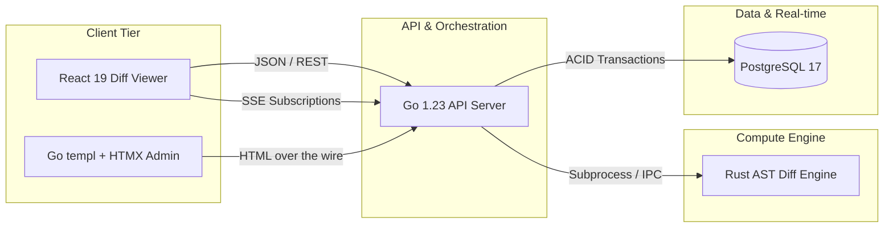

# 🔍 tm3l-break-detector

> **Drop in any two versions of an API spec and instantly see what broke, what's risky, and what's safe.**

[](LICENSE)
[](go.mod)
[](engine/Cargo.toml)
[](viewer/package.json)

---

## 📖 Table of Contents
1. [Overview](#-overview)
2. [Architecture](#-architecture)
3. [Tech Stack](#-tech-stack)
4. [Getting Started](#-getting-started)
5. [Documentation](#-documentation)

---

## 🌟 Overview
Every engineering team has been burned by an API breaking change nobody caught. **Break Detector** is a semantic AST diffing engine that analyzes OpenAPI 3.0/3.1 specifications to instantly highlight breaking vs. additive changes. 

## 📊 Architecture



## 🛠 Tech Stack
- **Engine**: Rust 2024 (Strict AST validation & semantic diffing)
- **API**: Go 1.23 + `templ` + `HTMX`
- **UI**: React 19 + TypeScript + Vite 6 + Tailwind CSS
- **Databases**: PostgreSQL 17 (Primary)

## 🚀 Getting Started
```bash
git clone https://github.com/tm3l/tm3l-break-detector.git
cd tm3l-break-detector
make docker-up
```
Visit `http://localhost:5173` for the interactive diff viewer.

## 📚 Documentation
See [`docs/architecture.md`](docs/architecture.md) for detailed internals.
