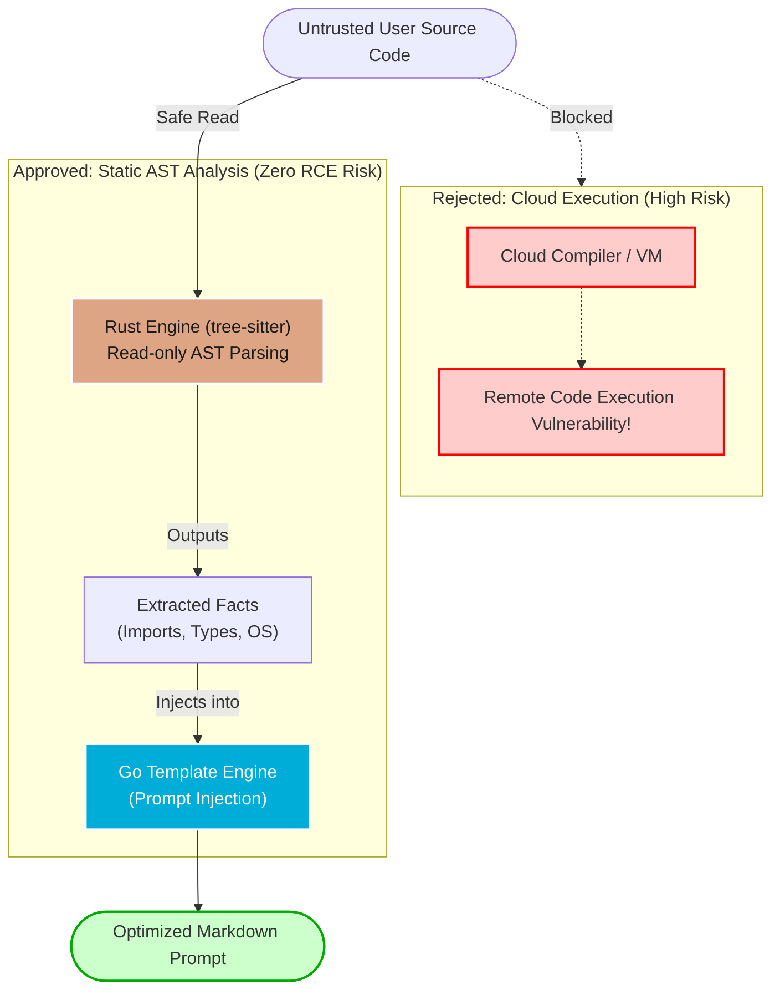

# ADR-011: AST-Driven LLM Prompt Synthesis

## 1. Context
We need to provide compilation instructions for arbitrary user code. Executing arbitrary code or running heavy compilation toolchains (e.g., GCC, PyInstaller) on the TM3L Go servers introduces severe security vulnerabilities and bloats the container footprint.

## 2. Decision
We will NOT build a compilation engine. We will build a **Prompt Synthesis Engine**.
1. **Static Analysis over Execution:** The Rust engine will parse the incoming source code into an Abstract Syntax Tree (AST) using `tree-sitter`.
2. **Fact Extraction:** Rust will traverse the AST to extract imports, system calls, and syntax versions.
3. **Template Injection:** The Go backend will receive these extracted facts and inject them into a rigorous Prompt Template.

## 3. Consequences
- **Positive:** Zero remote-code-execution (RCE) risk. The TM3L servers never execute the user's code.
- **Positive:** Infinite scalability. We offload the actual compilation logic and heavy lifting to the user's local machine and their chosen LLM provider.
- **Negative:** The user still has to manually run the final commands, meaning the UX is not fully automated ("push button compile"). However, this trade-off is acceptable for an enterprise governance tool where humans must remain in the loop.

## 4. Architectural Visualizations

To establish TM3L Platform Law and explicitly mandate our security posture, this diagram contrasts the extreme risk of remote code execution against our zero-risk static analysis pipeline. By refusing to execute untrusted code and instead utilizing Rust for read-only AST traversal, we achieve infinite scalability and perfect isolation.

