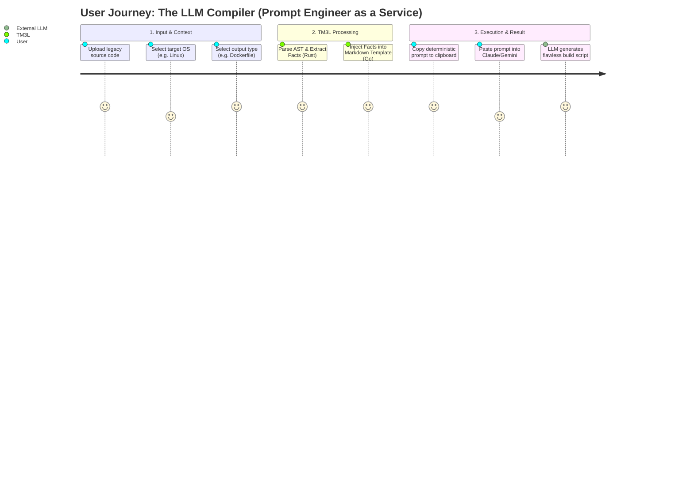

# PDR-002: Deterministic Prompt Generator

## 1. Context & Problem
Developers frequently struggle to compile complex legacy codebases (e.g., Python to binary, C++ cross-compilation). While Large Language Models (LLMs) like Claude or Gemini can write excellent compilation scripts, they hallucinate or provide generic answers when the human operator fails to provide precise structural context (e.g., hidden dependencies, language versions, OS constraints).

Building a universal cloud compilation engine within TM3L is out of scope, prohibitively expensive, and insecure.

## 2. Product Vision
Instead of compiling the code, TM3L will compile the **System Prompt**. 
The product acts as an advanced "Prompt Engineer as a Service." It will analyze the user's source code and output a hyper-optimized, deterministic Markdown prompt. The user can then paste this prompt into their LLM of choice to achieve flawless, context-aware compilation instructions.

## 3. Core Features
1. **User Customization:** Users must be able to select their desired compilation targets via the UI (e.g., Local CLI only, Dockerfile, or GitHub Actions CI/CD). We will not force a single strategy on the user.
2. **Deterministic Context Injection:** The generated prompt must inject absolute facts discovered by the underlying Rust engine (e.g., "The AST found dependencies X and Y. You must include them as hidden imports.").
3. **Markdown Export:** The final generated prompt must be delivered to the user as a structured Markdown document with 1-click copy/download capabilities.

## 2. Decision Options & Alternatives Considered
To be documented.

## 4. Consequences & Trade-offs
To be documented.

## 5. Product Visualizations

This user journey map visualizes our core product value proposition: "Prompt Engineer as a Service". By completely abstracting the complexity of AST parsing and compilation environment design, we empower developers to generate flawless scripts via their LLM of choice without suffering from hallucinated dependencies.

